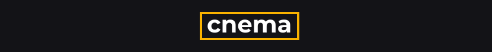
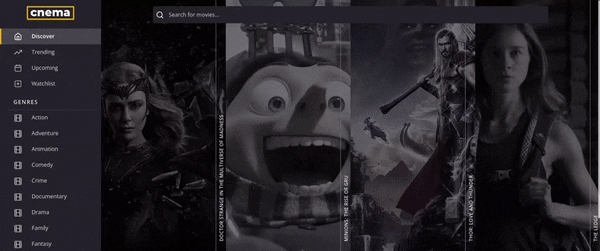
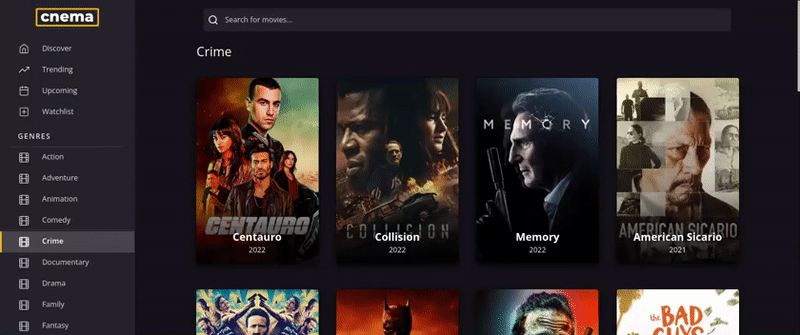

<div id="top" />



<h2 align="center"><a href="https://justinpv98.github.io/cnema/" target="_blank">Click for Live Demo</a></h2>

**cnema** is a React web application that uses The Movie Database (TMDB) API to allow casual movie watchers and hobbyists to find information about the movies they enjoy and save them to their watchlist for later.

### Table of Contents

- [About the Project](#about)
  - [Technologies](#technologies)
  - [Features](#features)
  - [Goals](#goals)
  - [Process](#process)
- [Screenshots](#screenshots)
- [Getting Started](#getting_started)
  - [Prerequisites](#prerequisites)
  - [Installation](#installation)
  - [Testing](#testing)
- [Contributing](#contributing)
- [Acknowledgements](#acknowledgements)
- [License](#license)

<p align="right">(<a href="#top">back to top</a>)</p>

## About the Project <a name="about"></a>

### Technologies <a name="technologies"></a>

[![React][react.js]][react-url] 
[![React Query][react-query]][react-query-url] 
[![Sass][sass-lang]][sass-url] 
[![CSS Modules][css-modules]][cssmodules-url]

### Features <a name="features"></a>

- Search for your favorite movies
- Find movies based on genre or a predefined category (upcoming, trending, etc.)
- Make use of infinite scrolling for a more enjoyable user experience
- View movie trailers, summaries, and casting data
- Add and remove movies to and from a persistent watchlist

### Goals <a name="goals"></a>

- Become more familiar with React Query
- Demonstrate competency in building CRUD aplications with React and Sass.

### Process <a name="process"></a>

- Designed the concept in Figma using multiple points of inspiration
- Planned the components, containers, and pages
- Simulated kanban board work environment until project completion

<p align="right">(<a href="#top">back to top</a>)</p>

## Screenshots <a name="screenshots"></a>





<p align="right">(<a href="#top">back to top</a>)</p>

## Getting Started <a name="getting_started"></a>

### Prerequisites <a name="prerequisites"></a>

First, [register][tmdb-register] or [login][tmdb-login] to TMDB to get your API key.

Then, create an .env.local file in the root of your project folder, and input your API key as such:

```
REACT_APP_API_KEY = [your api key]
```

### Installation <a name="installation"></a>

Clone the repo and install through your method of choice.

```
$ git clone https://github.com/justinpv98/cnema.git
$ cd cnema
$ npm install
```

Run a development server.

```
npm start
```

### Testing <a name="testing"></a>

Run unit and component/integration tests.

```
npm run test
```

> If using Jest Runner in VSCode, add "jestrunner.configPath": "config/jest.config.js" to your settings

<p align="right">(<a href="#top">back to top</a>)</p>

## Contributing <a name="contributing"></a>

Contributions, issues and feature requests are welcome.
<p align="right">(<a href="#top">back to top</a>)</p>

## Acknowledgements <a name="acknowledgements"></a>

[TMDB][tmdb] for usage of their API.

<p align="right">(<a href="#top">back to top</a>)</p>

## License <a name="license"></a>

Distributed under the MIT License. See `LICENSE` for more information.

<p align="right">(<a href="#top">back to top</a>)</p>

<!-- LINKS -->

[tmdb]: https://www.themoviedb.org/
[tmdb-login]: https://www.themoviedb.org/login
[tmdb-register]: https://www.themoviedb.org/signup
[react.js]: https://img.shields.io/badge/react-20232A?style=for-the-badge&logo=react&logoColor=61DAFB
[react-url]: https://reactjs.org/
[sass-lang]: https://img.shields.io/badge/sass-CC6699?style=for-the-badge&logo=sass&logoColor=white
[sass-url]: https://sass-lang.com/
[react-query]: https://img.shields.io/badge/react_query-002C4B?style=for-the-badge&logo=reactquery&logoColor=FF4154
[react-query-url]: https://tanstack.com/query/v4/docs/overview
[css-modules]: https://img.shields.io/badge/css_modules-black?style=for-the-badge&logo=cssmodules&logoColor=white
[cssmodules-url]: https://github.com/css-modules/css-modules
[jest-js]: https://img.shields.io/badge/jest-C21325?style=for-the-badge&logo=jest&logoColor=white
[jest-url]: https://jestjs.io/
